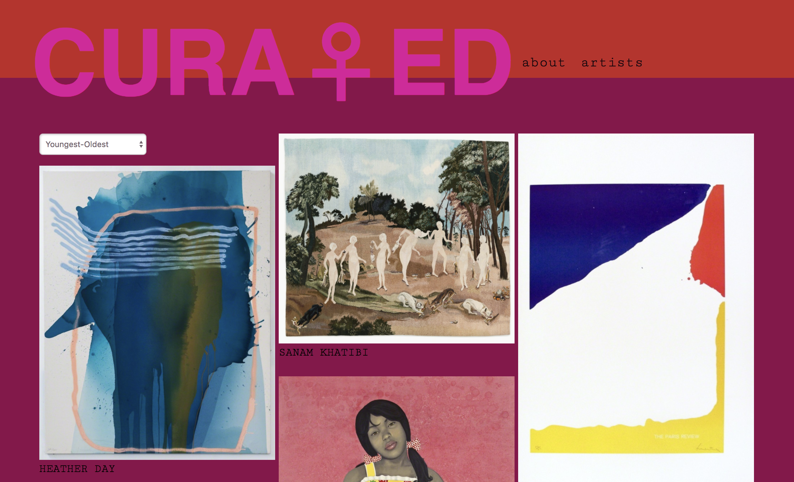
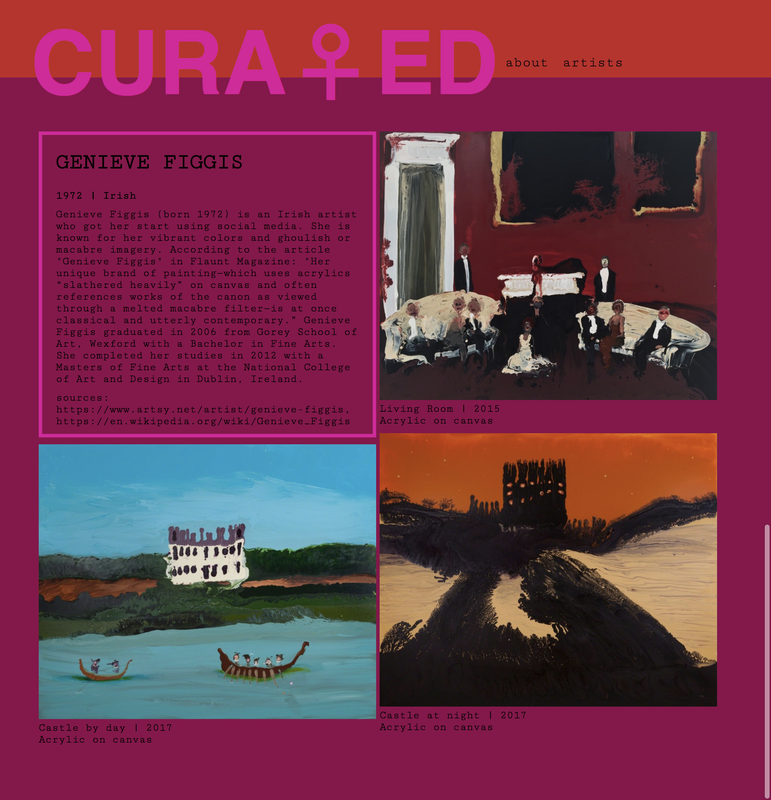

## CURA♀ED

<a href="http://www.curatedart.ca/artists">Live Site</a>

## About
This is a React/Redux frontend for this <a href="https://github.com/jessmitch42/art-app-backend">Rails</a> backend. It provides a preview page for a list of artists, as well as an artworks view for each individual artist. Artists can be sorted from the home page. I also used <a href="https://github.com/joshwcomeau/react-flip-move">React Flip Move</a> for animations and React Router for routing.

BTW: This project was bootstrapped with [Create React App](https://github.com/facebookincubator/create-react-app).

## What is it?
CURA♀ED provides a curated list of female contemporary artists you may or may not know. This repo is just the views.

## Usage

Fork, clone, `npm install && npm start`. Making use you have the <a href="https://github.com/jessmitch42/art-app-backend">API</a> running locally as well and update your base url in /src/actions/actions.js (two spots).

## Next Steps
Ideally, I'd like to update this app to have user authentication that allows individual users to interact with the app more, such as liking paintings, suggesting new artists, or uploading artworks/artists themselves. This version should be considered a basic MVP.

## Contributing
Please feel welcome to create an issue or open a pull request with any bugs/suggestions. Keep in mind this is a small personal project, though..

## License
This app is licensed under Creative Commons Attribution-NonCommercial 4.0 International (CC BY-NC 4.0).
